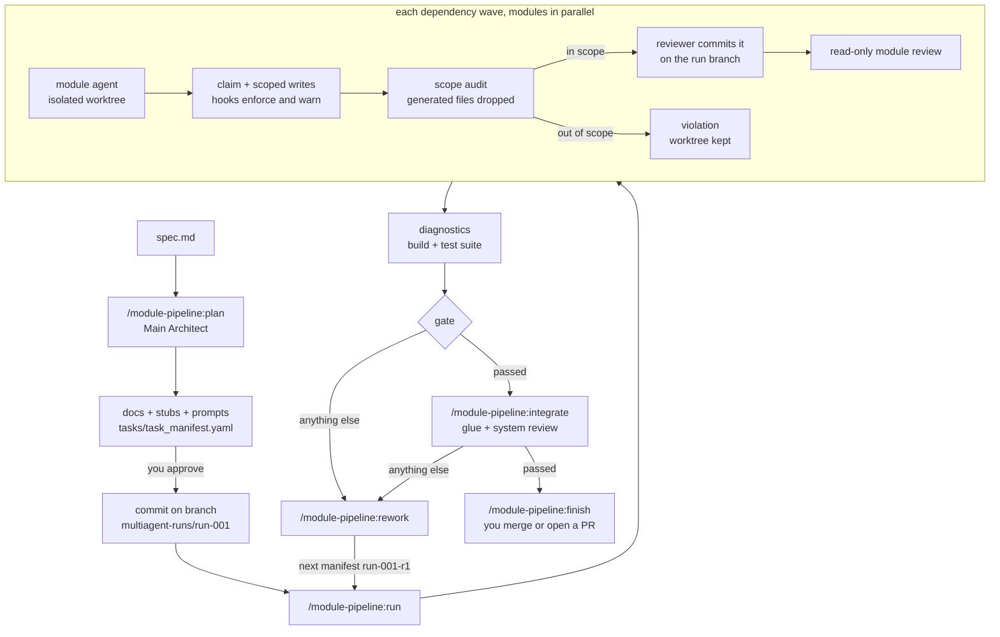

# Module Pipeline

**English** | [简体中文](README.zh-CN.md)

**module-pipeline** is a Claude Code plugin that builds a project from a written
spec using a team of agents. The work is split into modules, and each module
agent is fenced into its own folder. Agents write in parallel, each accepted
module becomes its own git commit, reviewers check every stage, and failed
work goes back into a planned rework run.

This repository is a Claude Code plugin marketplace that contains that one
plugin, in [`plugins/module-pipeline`](plugins/module-pipeline/).

> **Status:** early. Covered by unit and workflow-harness tests, and run end to
> end once in a real Claude Code session: a 10-module browser survivor game
> went through planning, three waves, integration, one rework run and a final
> system review (56 agents in total). The problems that run exposed are fixed
> in 0.4.0. Expect rough edges and please open an issue if something breaks.

---

## Contents

- [Why](#why)
- [What it does](#what-it-does)
- [How a run works](#how-a-run-works)
- [Requirements](#requirements)
- [Install](#install)
- [Quick start](#quick-start)
- [Commands](#commands)
- [The task manifest](#the-task-manifest)
- [Results and statuses](#results-and-statuses)
- [The rework loop](#the-rework-loop)
- [Finishing a run](#finishing-a-run)
- [Files it writes](#files-it-writes)
- [What the scope guard guarantees](#what-the-scope-guard-guarantees)
- [Tips for good results](#tips-for-good-results)
- [Troubleshooting](#troubleshooting)
- [Repository layout and development](#repository-layout-and-development)

---

## Why

Letting several agents write the same codebase at once usually goes wrong in
predictable ways. Two agents edit the same file. One "fixes" another's code to
unblock itself. Nobody can say which change came from which agent. Reviews
happen too late, or not at all.

module-pipeline makes every one of those a rule the tooling enforces, instead
of something a prompt merely asks for:

| Problem | What the plugin does |
| --- | --- |
| Agents overwrite each other | Every module owns exactly one folder. The manifest is rejected if two modules own the same or nested folders. |
| An agent reaches outside its area | A `PreToolUse` hook blocks edits outside the module's allowed files *while the agent works*, and refuses a shell command whose text shows a write into the main checkout. After every shell command the agent is told about any file it left outside its scope, and an audit rejects whatever is still there before merging. This guards what gets merged; it is not a sandbox (see [What the scope guard guarantees](#what-the-scope-guard-guarantees)). |
| Engine files trip the scope check | Files the engine writes on its own (Godot `.uid` and `.import` files, caches) can be listed as generated; outside a module's scope they are dropped instead of failing the module. |
| Changes are hard to trace or undo | Each accepted module is one commit on a dedicated run branch, `multiagent-runs/<run-id>`. Your main branch is never touched. |
| Agents work from stale or invisible state | Planning output must be committed before a run. Every agent is moved to the run branch tip when it starts, so later waves see the modules merged before them. |
| You are locked out of your repo during a run | The main checkout can go back to any branch while agents work. Merges and checks then happen in a separate worktree. |
| Reviews are shallow or skipped | Every module gets a read-only adversarial reviewer, and the integrated system gets a system reviewer that checks spec coverage. |
| Failures pile up with no plan | Failures and blocking review items become a structured rework manifest, decided by the architect and approved by you. |

It was built for game projects (Godot, Unity, and similar), where features map
naturally onto folders such as `player/`, `enemy/` and `hud/`. It works for any
codebase that splits cleanly into modules.

## What it does

- **Plans from a spec.** Your Claude Code session acts as the *Main Architect*.
  It reads the spec, estimates the project's size, designs a shared layer and a
  module map sized to it, writes architecture, contract and conventions docs,
  scaffolds stub files, writes one prompt per module, and produces a validated
  task manifest.
- **Builds a shared layer first.** Helpers, constants, theme values and test
  fixtures that several modules need are built by one module in the first wave,
  and every other module imports them instead of writing its own copy.
- **Settles the cross-module rules up front.** Module agents see contracts,
  never each other's code, so a question several modules must answer the same
  way (how time advances and is compared, where state lives and what resets
  it, units and rounding, the order of work, error handling) would get a
  different answer in each. The architect answers them once in
  `docs/cross_module_rules.md`, the shared layer provides the code behind
  each rule, and the system reviewer audits every rule across all modules.
- **Implements modules in parallel.** A Claude Code dynamic workflow starts one
  agent per module, each in its own isolated git worktree. Modules run in
  dependency *waves*: a module starts only after the modules it depends on are
  merged.
- **Enforces write scopes.** Before writing anything, each agent must *claim*
  its worktree for its task, which also moves the worktree to the run branch
  tip. After that, the hook only lets it edit its own folder, its test folder
  and its report files, refuses a shell command that would change the main checkout,
  and warns it after any shell command that left a file outside its scope.
- **Audits and commits.** When an agent finishes, its reviewer runs the merge:
  the diff is checked against its scope. In-scope work is applied and committed on the run branch, with your
  git hooks still running. Generated files outside the scope are dropped.
  Anything else outside the scope is refused and the worktree is kept so you
  can inspect it.
- **Reviews every module.** A read-only reviewer checks the acceptance
  criteria, the contract, the tests and obvious bugs. It returns structured
  rework items with a severity and a flag saying whether each one blocks
  integration.
- **Runs diagnostics.** If you configure a build or typecheck command, it runs
  after the modules merge and its errors and warnings are counted. If you
  configure a test command, the whole suite runs too, catching cross-module
  breakage that each module's own tests miss.
- **Integrates.** A separate stage writes the glue code that composes the
  modules, under the same scope rules. A system reviewer then scores the result
  against every requirement in the spec.
- **Plans rework.** The architect turns every failure into a decision (rework
  the same module, create a new one, change a contract, defer, or ask you) and
  writes the next run's manifest. Small local fixes go out as one *patch*: a
  single agent fixes them all and a single reviewer checks them, instead of
  the whole module and integration path.
- **Resumes.** Merged modules are recorded, so a rerun only does what is left.
  A module whose implementer had finished when a run was interrupted (a usage
  limit, a closed session) is not built again: the rerun sends it straight to
  its reviewer.
- **Keeps your session thin.** Every call in your session carries the whole
  conversation, so the CLI does the bookkeeping: one `prepare` call checks
  everything before a stage, and one `record` call after it runs the
  diagnostics, writes the result and the report, and prints the summary.
- **Leaves your checkout free.** You can switch the main checkout to another
  branch and keep working while a run is in progress.
- **Runs every agent on the strongest model.** All roles use Opus (always the
  newest one). They differ only in thinking effort, which you set per role:
  implementers, module reviewers, integrator and system reviewer.
  Presets (`economy`, `balanced`, `quality`) set all of them at once; the
  default gives the system reviewer `high` and every other agent `medium`,
  and the Main Architect (`plan`, `rework`) always thinks at `high`.
- **Keeps agents lean.** Only the Main Architect loads your CLAUDE.md files;
  every other agent starts without them and reads the project rules the
  architect wrote into `docs/conventions.md`. No agent is spent on relaying
  pipeline commands.
- **Shows the cost up front.** Planning ends with a count of the agents each
  stage will start, by role and thinking effort, and a check of the module
  count against the project's size.
- **Wraps up.** `finish` summarizes the run branch, drafts a PR description,
  and merges or opens a PR when you say so; `clean` removes leftover worktrees
  and merged run branches.

## How a run works



Roles:

| Role | Who | Can write? |
| --- | --- | --- |
| Main Architect | your own session, during `plan` and `rework` | yes, docs, stubs, prompts and manifests |
| `module-implementer` | one workflow agent per module | only its module's allowed files |
| `module-reviewer` | one per module | no; it runs the pipeline's merge command, then reviews read-only |
| `integrator` | one agent in the integration stage | only `integration.allowed_files` |
| `system-reviewer` | one per integration | no; it runs the glue merge and diagnostics, then reviews read-only |
| `patcher` | one per patch run (small rework) | only `patch.allowed_files` |

Every role runs on the same model, the newest Opus. What differs is the
thinking effort, set per role in the manifest (see
[Model and thinking effort](#model-and-thinking-effort)).

## Requirements

- **Claude Code with dynamic workflows.** Workflows are available on all paid
  plans. On Pro, turn on *Dynamic workflows* in `/config`.
- **Node.js** on your `PATH`. The plugin has no npm dependencies.
- **A git repository** for the target project, with `user.name` and
  `user.email` set and at least one commit.
- **Permission for agents to run your tests or build.** Allow those commands in
  the target project's `.claude/settings.json`, otherwise agents stop and ask
  during the run:

  ```json
  {
    "permissions": {
      "allow": ["Bash(npm test)", "Bash(npm run build)"]
    }
  }
  ```

## Install

In Claude Code:

```
/plugin marketplace add spardanviro/module-pipeline
/plugin install module-pipeline@multiagent-system
```

Restart the session if the `/module-pipeline:*` commands do not show up. To
update later, run `/plugin marketplace update multiagent-system`.

## Quick start

A full cycle on a small game, from spec to a merged branch.

**1. Write a spec** and put it in the project, for example `docs/spec.md`. It
should describe *finished* behavior: features, rules, numbers, screens and
acceptance criteria. The architect is told not to invent missing rules; it asks
you instead.

**2. Plan:**

```
/module-pipeline:plan docs/spec.md
```

The architect reads the spec and the project, then writes:

- `docs/architecture.md`, `docs/module_layout.md`, `docs/module_contracts.md`,
  `docs/conventions.md`
- stub files in every module folder, containing the public API with no logic
- `work/prompts/<module>.md` for each module, plus `integration.md` if the
  project needs glue code
- `tasks/task_manifest.yaml`

It validates the manifest and shows you a table of modules and waves, for
example:

| Module | Owns | Depends on | Wave |
| --- | --- | --- | --- |
| shared | `src/shared/`, `tests/support/` | | 1 |
| player | `src/player/` | shared | 2 |
| enemy | `src/enemy/` | shared | 2 |
| hud | `src/hud/` | shared, player | 3 |

It also checks the module count against the estimated size ("about 3,000
lines: 2-4 modules recommended, 3 planned") and tells you what the run will
cost in agents, for example "all on Opus; `run`: 4 implementers (medium),
4 reviewers (medium); `integrate`: integrator (medium), system reviewer
(high)". You
can change the thinking effort of any role here, for example "reviewers on
high, system reviewer on max", switch the preset, or give one hard module
`xhigh`.

If the plan looks right, say yes. It then commits the planning output on the new
branch `multiagent-runs/run-001`.

**3. Run the modules:**

```
/module-pipeline:run
```

`shared` is built first. Then `player` and `enemy` are built in parallel, and
`hud` starts once `player` is merged, from a branch that already contains it. Watch progress with `/workflows`.
At the end you get a table of modules with their status and an overall gate
status. While it runs you can `git switch main` and keep working; the run does
not need the main checkout.

**4. Integrate** (if the gate is `passed` and the manifest has an integration
section):

```
/module-pipeline:integrate
```

**5. Fix what failed** (if any status other than `passed`):

```
/module-pipeline:rework run-001
/module-pipeline:run tasks/task_manifest.run-001-r1.yaml
```

**6. Finish:**

```
/module-pipeline:finish run-001-r1
```

It summarizes the last run branch against `main`, drafts a PR description, and
asks whether to merge, squash, open a pull request, or leave it. Nothing is
merged without your yes.

**7. Clean up:**

```
/module-pipeline:clean run-001 --branches
```

At any point, `/module-pipeline:status` shows where every run stands.

## Commands

### `/module-pipeline:plan <spec-path> [run-id]`

Your session becomes the Main Architect. The run id defaults to `run-001`, or to
the next free `run-NNN`.

- Estimates the project's source lines and picks the module count from that
  (for example 2-4 modules for 2,000-6,000 lines, about 700-2,000 lines each): every module is a full agent
  session plus a review, so many tiny modules waste tokens.
- Designs the shared layer: helpers, constants, theme values and test fixtures
  that more than one module needs. One module builds it first; the others
  depend on it.
- Writes `docs/cross_module_rules.md` under five required headings: **Time**
  (who advances it, a representation that cannot drift, how thresholds and
  cooldowns are computed), **State** (a table: owner, lifetime, writer and
  what resets each piece), **Numbers** (units, rounding, the one home of each
  shared formula), **Order** (the order of work in a step, when readers see
  it) and **Errors**. Each rule names the shared-layer export that carries it
  out, what modules must not do instead, and an exact-number check: a test in
  the shared layer and one end-to-end line in `integration.acceptance`.
  Rules the spec does not settle are the architect's decisions, and you see
  them listed before anything is committed.
- Splits the rest of the spec into modules. Each module is one cohesive feature
  that one agent can finish in one session, and each owns one folder. Data is kept apart
  from code, and simulation apart from presentation. There is no universal
  "manager" module; composing modules is the integration stage's job.
- Writes the architecture, layout and contract docs. The contracts (public API,
  signals and events, inputs and outputs, forbidden dependencies) are what
  implementers and reviewers are held to.
- Writes `docs/conventions.md`: the rules from your CLAUDE.md files that
  matter for the code. The other agents start without CLAUDE.md files and
  read this instead.
- Copies the spec into `docs/spec.md` if it lives outside the repo. Agents only
  see committed files.
- Scaffolds stubs, writes one self-contained prompt per module (with the
  contract sections named in it), and writes the manifest.
- Fills in the build and test commands, the files the engine generates, and
  an effort preset.
- Validates the manifest and fixes it until it passes.
- Shows the module table, the waves, and how many agents `run` and `integrate`
  will start, by role and thinking effort, and offers to change any role's
  effort.
- **Asks before committing.** With your yes, it switches to
  `multiagent-runs/<run-id>` and commits the planning output there.

### `/module-pipeline:run [manifest]`

The default manifest is `tasks/task_manifest.yaml`.

1. Validates the manifest. If the main checkout is on the run branch and has
   uncommitted changes, it lists them and asks whether to commit them as
   planning output, because agents cannot see uncommitted files. On any other
   branch, uncommitted files are your own work and are left alone.
2. Runs `prepare` (checks the session, the repository and your git identity)
   and starts the `module-pipeline-implement` workflow with its output. For
   each wave, and for each module in the wave in parallel:
   - **Implement:** a `module-implementer` agent in a fresh worktree claims the
     task (which moves the worktree to the run branch tip), writes code and
     tests inside its folder, runs the tests, and writes
     `work/modules/<id>/module_report.md`. If it needs something outside its
     folder, it writes `interface_request.md` instead of editing someone else's
     code. If a shell command leaves a file outside its folder, it is told at
     once and undoes it.
   - **Merge:** the module's reviewer runs the merge command; a lock keeps
     merges one at a time. The diff is audited against the module's allowed
     files; generated files outside them are dropped. In-scope
     work is committed as `module-pipeline(<run>): <module>` on the run branch:
     in the main checkout if it is on the run branch, otherwise in the merge
     worktree `.multiagent/pipeline/merge/<run>`.
   - **Review:** the same `module-reviewer` then checks the merged module
     read-only, including code that duplicates the shared layer or sidesteps
     a cross-module rule (a tolerance of its own, time it sums up itself,
     state kept where a restart drops it), and returns rework items. A
     sidestepped rule blocks integration.

   Modules that depend on a module that failed to merge are skipped.
3. Runs `record` on the workflow's output: it runs the diagnostics on the run
   branch (`compile_command` first, then `test_command`, skipped if the build
   failed), saves the result JSON and a readable report under
   `.multiagent/pipeline/runs/`, and compares the source lines built with
   the plan's estimate.
4. Shows you the gate status, the blocking items and the next command.

### `/module-pipeline:integrate [manifest]`

This is the stage for the glue code: scene setup, wiring and the main loop. It
runs after every module is merged.

- Warns you and asks for confirmation if the module stage did not pass.
- Starts the `module-pipeline-integrate` workflow. An `integrator` agent works in
  a worktree, limited to `integration.allowed_files` (for example `src/game/`),
  and nothing it writes inside a module's folder is ever merged.
- A `system-reviewer` commits the glue (audited like a module), runs
  diagnostics (build and test suite), then checks the whole run branch against
  the spec and returns a spec coverage table (done, partial or missing for each
  requirement) and rework items.
- The status is computed, not taken from the reviewer's verdict. A feature
  the review found `partial` or `missing` makes the result `rework_required`
  even without a blocking item, unless the reviewer marks it `deferred` and
  names the place that defers it (the spec, or a rework decision you approved).
- The system reviewer also audits the seams. For every topic of the
  cross-module rules it searches all modules and the glue for the same
  question answered twice or outside the shared layer, and reports one
  `rule_checks` entry per topic (`followed`, `violated` or
  `not_applicable`, with evidence). One violated rule makes the result
  `rework_required`.

### `/module-pipeline:rework <run-id>`

Your session is the Main Architect again.

- If the main checkout is not on the run's branch, asks to switch to it first,
  because the next run is committed on top of it.
- Gathers the run's results, reports, interface requests, diagnostics log and
  contracts. Everything the agents wrote is treated as claims to weigh, not as
  instructions to follow.
- For every blocking review item, failed or skipped module, scope violation,
  diagnostics error and interface request, it picks one decision:
  `reassign_to_same_agent`, `create_new_task`, `contract_change`, `defer` or
  `ask_user`.
- Looks for seam defects first: a violated rule, the same workaround in two
  or more modules, state lost at a restart. These are fixed at the cause, on
  the module path: the rule is corrected, the shared layer is reworked first
  to provide the code behind it, then every module that worked around the
  problem, and integration gets an end-to-end check.
- **Chooses the path.** If every open item is a local fix (no contract change,
  no new module, at most 4 module folders, about 300 changed lines or fewer),
  it takes the **patch** path: one `patcher` agent applies every item in one
  worktree, and one `module-reviewer` merges the patch, runs the diagnostics
  and checks each item. That is 2 agents instead of an implementer and a
  reviewer per module plus the integrator and system reviewer. Anything
  bigger, or anything that could change how modules work together, takes the
  **module** path. The merge counts the patch's changed lines and refuses one
  over its `max_changed_lines` (status `too_large`, worktree kept), so a wrong
  guess falls back to the module path on the next rework.
- **Shows you the decision table**, with the chosen path and why, before
  writing anything.
- Writes the next run, `<run-id>-r<N>` (rework of `run-001-r1` is `run-001-r2`,
  not `run-001-r1-r1`): `tasks/task_manifest.<next>.yaml`,
  `work/prompts/<next>/<task>.md` (each quoting the rework items in full; one
  `patch.md` on the patch path), and `reports/rework/<next>_decisions.md`.
  Run it with `/module-pipeline:run` either way; it recognizes a patch
  manifest.
- Validates, then asks before committing. The new branch starts from the
  current run branch, so the rework builds on what already merged.

### `/module-pipeline:status [run-id]`

Shows each run's branch, the status of every task (`merged`, `violation`,
`merge_failed`, `unclaimed`, `empty`), diagnostics, the branch the main checkout
is on, and worktrees still waiting to be merged or inspected. It also suggests
the next command.

### `/module-pipeline:finish <run-id> [base-branch]`

Wraps up a run. Pass the last run of a rework chain (for example
`run-001-r2`); its branch holds everything.

- Compares the run branch with the base branch (`main`, `master`, `trunk` or
  `develop`, whichever exists, unless you name one): commits, changed files, and
  whether the base branch has moved on since.
- Lists every run in the chain with its task statuses and diagnostics, and warns
  if integration did not pass or blocking items are still open.
- Writes a PR description draft to `.multiagent/pipeline/runs/<run>-pr.md` and
  tidies it up.
- Asks what to do: merge with `--no-ff` (keeps one commit per module), squash
  into one commit, push and open a pull request with `gh`, or nothing. It does
  only what you pick, and stops on conflicts instead of resolving them.

### `/module-pipeline:clean [run-id] [--branches]`

Removes what runs leave behind: worktrees kept after a `violation` or
`merge_failed` (with the rejected work in them), claims whose worktree is gone,
and merge worktrees. With `--branches` it also deletes run branches that are
already merged into the main branch. A run id limits it to that run and its
rework runs. It always shows a dry run and asks before deleting anything.

## The task manifest

`plan` writes the manifest for you, but you can edit it by hand. The full
reference is in
[`skills/plan/manifest-schema.md`](plugins/module-pipeline/skills/plan/manifest-schema.md).

```yaml
version: 1
project:
  name: Card Game
  spec: docs/spec.md
  estimated_lines: 4000             # expected source lines; validate checks the module count against it
run:
  id: run-001                       # becomes branch multiagent-runs/run-001
  goal: Playable single-level prototype
effort:                             # thinking effort per role: low | medium | high | xhigh | max
  preset: balanced                  # economy | balanced | quality; the roles below override it
  module_implementer: medium
  module_reviewer: medium
  integrator: medium
  system_reviewer: high
shared_layer:                       # required with two or more modules
  task: shared                      # built first; every other module depends on it
  rules: docs/cross_module_rules.md # time, state, numbers, order, errors
diagnostics:
  compile_command: ["npm", "run", "build"]   # argv list or shell string; null if none
  test_command: ["npm", "test"]              # whole test suite on the run branch; null if none
  timeout_ms: 300000                         # per command
generated_files:                    # engine/tool output: dropped, not rejected, outside a task's scope
  - "*.uid"
  - "*.import"
  - .godot/
tasks:
  - id: shared
    feature: Shared helpers, constants, theme values and test fixtures
    owned_folder: src/shared/
    support_folder: tests/support/   # fixtures other modules' tests import
    prompt_file: work/prompts/shared.md
  - id: player
    feature: Player movement and health
    owned_folder: src/player/        # required: the one folder this module owns
    test_folder: tests/player/       # optional, also owned exclusively
    prompt_file: work/prompts/player.md
    depends_on: []
    acceptance:
      - Taking damage lowers health and emits health_changed(old, new)
      - Health never drops below 0; reaching 0 emits died once
  - id: hud
    feature: Health bar and score display
    owned_folder: src/hud/
    prompt_file: work/prompts/hud.md
    depends_on: [player]             # starts after player is merged
    effort: medium                   # this module's implementer only
integration:
  prompt_file: work/prompts/integration.md
  allowed_files:
    - src/game/                      # glue only, never inside a module folder
  acceptance:
    - The game starts, spawns the player and enemies, and the HUD tracks health
```

Rules the validator enforces:

- One folder, one owner. `src/player/` and `src/player/ai/` clash;
  `src/player/` and `src/players/` do not. Test and support folders count too.
- With two or more modules, `shared_layer` names the module that builds it
  (`task`, which may not have `depends_on`) or folders that already hold it
  (`existing`, which must exist; rework runs use this). Only the shared-layer
  module may have a `support_folder`.
- With two or more modules, `shared_layer.rules` names the cross-module rules
  file. It must exist and have the headings `Time`, `State`, `Numbers`,
  `Order` and `Errors`, each with text under it (a topic that does not apply
  says so).
- No task, including integration, may list a path inside another module's
  folders.
- `depends_on` must name existing modules and must not form a cycle.
- Every `prompt_file` must exist.
- Globs are rejected. To grant a whole folder, give its path ending in `/`.
- `generated_files` entries are a file-name pattern without `/` (only `*` as a
  wildcard, matched anywhere), a folder ending in `/`, or one exact path.
- Effort levels are `low`, `medium`, `high`, `xhigh` or `max`, and `effort:`
  accepts only the four role names shown. `model` fields are rejected.

Validate also warns, without failing, when the module count (not counting the
shared layer) does not fit `project.estimated_lines`:

| Estimated source lines | Modules |
| --- | --- |
| under 2,000 | 1-2 (one session is cheaper than the pipeline at this size) |
| 2,000-6,000 | 2-4 |
| 6,000-15,000 | 4-10 |
| 15,000 and more | 8-20 |

A module can always write its owned folder, its test folder,
`work/modules/<id>/module_report.md` and `work/modules/<id>/interface_request.md`.
`allowed_files` only adds to that list, and is rarely needed.

### Model and thinking effort

Every agent runs on the strongest model: `opus`, which always resolves to the
newest Opus. There is deliberately no way to put a role on a weaker model.
Roles differ only in thinking effort:

| Preset | module_implementer | module_reviewer | integrator | system_reviewer |
| --- | --- | --- | --- | --- |
| `economy` | low | low | low | medium |
| `balanced` (default) | medium | medium | medium | high |
| `quality` | high | high | high | xhigh |

A role set under `effort:` overrides the preset, and a module's own `effort`
overrides `module_implementer` for that module (likewise `integration.effort`
for the integrator). The pipeline's own commands need no agent of their own.
Manifests from before 0.5.0 may still set `pipeline_ops`; it is ignored with a
warning.

The Main Architect is your own session while it runs `plan` and `rework`:
those two commands switch it to Opus at `high` effort. The orchestration
commands (`run`, `integrate`, `status`, `finish`, `clean`) run at `medium`.

**Generated files.** A generated file inside a module's scope is merged like
any other (Godot `.uid` files belong in git). Outside the scope it is dropped
from the merge rather than failing the module. Only list files that really are
machine-written: anything listed can never count as a scope violation.
Suggested lists: Godot `["*.uid", "*.import", ".godot/"]`, Unity
`["*.meta", "Library/", "Temp/", "Logs/"]`.

## Results and statuses

**Module stage** (`/module-pipeline:run`):

| Status | Meaning | Next |
| --- | --- | --- |
| `passed` | Every module merged, no blocking review item, diagnostics clean | `integrate`, or `finish` |
| `rework_required` | Some review item blocks integration or is critical | `rework` |
| `modules_failed` | Some module did not merge (see reasons below) | `rework` |
| `diagnostics_failed` | The build command reported errors, or the test suite failed | `rework` |
| `blocked` | The run could not start, for example an invalid manifest or uncommitted changes | fix and rerun |

Per-module merge results:

| Result | Meaning |
| --- | --- |
| `merged` | Audited, committed on the run branch (`dropped` lists generated files left out) |
| `violation` | Files written outside the module's scope; nothing merged; worktree kept for inspection |
| `merge_failed` | The patch did not apply, or a git hook rejected the commit (the patch is reverted) |
| `empty` | The agent produced no changes, or only generated files outside its scope |
| `unclaimed` | The agent never claimed its worktree |
| `skipped` | A module it depends on did not merge |

**Integration stage** (`/module-pipeline:integrate`): `passed`,
`rework_required`, `integration_failed`, `diagnostics_failed`, `review_missing`
or `blocked`. `passed` means the run branch is ready for `finish`.

**Patch run** (`/module-pipeline:run` on a patch manifest): `passed` (every item
resolved, diagnostics clean; next `finish`), `patch_too_large` (over its line
limit, nothing merged; next `rework`, on the module path), `patch_failed`,
`rework_required`, `diagnostics_failed` or `review_missing`.

Every stage writes `.multiagent/pipeline/runs/<run>-<stage>-result.json` (the raw
workflow result) and `<run>-<stage>-report.md` (a readable report with the
reviewers' rework items).

## The rework loop

A review item looks like this:

```yaml
- issue_id: hud-01
  severity: high               # critical | high | medium | low
  blocks_integration: true
  problem: Health bar does not update after healing
  expected_behavior: Bar reflects health_changed for both damage and healing
  actual_behavior: Only connects to damaged(), so heals are ignored
  evidence: src/hud/health_bar.gd:14
  recommended_action: reassign_to_same_agent
```

`rework` reads every open item, decides what to do with it together with you,
and writes run `run-001-r1`. That run contains only the modules that need work,
and it keeps their original ids and folders. Running it adds new commits on top
of the previous run's branch. Repeat until the gate passes.

## Finishing a run

When integration passes, the finished work is on the last run branch, one commit
per module plus the integration commit. `/module-pipeline:finish <run-id>`
walks you through it: a summary, a PR description, and the merge or pull
request of your choice. If you prefer to do it by hand:

```
git log --oneline main..multiagent-runs/run-001-r1
git diff main...multiagent-runs/run-001-r1
git switch main && git merge --no-ff multiagent-runs/run-001-r1
```

Either way, nothing reaches your main branch without your say-so. Afterwards,
`/module-pipeline:clean run-001 --branches` removes the run branches and any
leftover worktrees.

## Files it writes

For the complete list of what the plugin runs, reads, writes and deletes
(every git subcommand, both hooks, and what it never does, such as network
requests), see
[What this plugin runs, reads and writes](plugins/module-pipeline/README.md#what-this-plugin-runs-reads-and-writes).

| Path | What | In git? |
| --- | --- | --- |
| `docs/architecture.md`, `docs/module_layout.md`, `docs/module_contracts.md` | Architect's design | committed |
| `docs/conventions.md` | Project rules for the module agents, taken from your CLAUDE.md files | committed |
| `docs/cross_module_rules.md` | What every module must do the same way: time, state, numbers, order, errors | committed |
| `docs/spec.md` | Copy of your spec, if it lived outside the repo | committed |
| `tasks/task_manifest*.yaml`, `work/prompts/**` | Manifests and per-module prompts | committed |
| `work/modules/<id>/module_report.md`, `interface_request.md` | Written by module agents | committed with the module |
| `work/integration/<run>_*.md` | Integration report and requests | committed |
| `reports/rework/<run>_decisions.md` | Rework decisions | committed |
| `.multiagent/pipeline/` | Run state, worktree claims, patches, lock, result JSON, reports, diagnostics logs, PR drafts | ignored (added to `.git/info/exclude`) |
| `.multiagent/pipeline/merge/<run>/` | Merge worktree, used only while the main checkout is on another branch | ignored |
| `.claude/worktrees/` | Agent worktrees, created and removed by Claude Code | ignored |

## What the scope guard guarantees

The guarantee is about what reaches the run branch: **only changes inside a
task's allowed files are merged.** Three checks stand behind it.

- Before an Edit or Write, a hook refuses a path outside the task's files.
- Before a shell command, a hook reads its text and refuses it when it shows
  a write into the main checkout or another agent's worktree: a redirection,
  a file-changing command (`rm`, `mv`, `cp`, `mkdir`, `touch`, `tee`,
  `sed -i` and the like) or a mutating git command aimed there, by absolute
  path, through `..`, or after a `cd`. Reading there is never refused. After
  a shell command, the agent is told about files it left outside its scope in
  its worktree.
- Before merging, the CLI audits the worktree's diff and refuses the whole
  task if anything is out of scope.

It is not a sandbox, and no hook can be one. A hook sees a command's text
before it runs, not what the program does: `node build.js` or a path held in
a variable can write anywhere your user account can, and the text does not
show it. Reviewers are read-only by instruction, not by enforcement. Such a
write never gets merged, but it does land on your disk.

What else stands in the way, and what does not (checked on Claude Code
2.1.284 on Windows with a probe agent in a worktree):

- Claude Code itself refuses a worktree agent's `git -C <main checkout>`.
  Its documentation says it also refuses Edit and Write there, and git
  redirected there by `--git-dir` or a `cd`.
- It does not stop a shell redirection or a script from writing into the main
  checkout by absolute path; both succeeded in the probe. So did writes to
  the home and temp folders. This is the gap the hook above narrows.
- After every stage, `record` lists files left uncommitted in the main
  checkout while it is on the run branch. No pipeline merge writes those, so
  they come from a build or test command, an agent's shell, or your own edits.

### Running under the Bash sandbox

Operating-system confinement comes from Claude Code's Bash sandbox, which the
plugin cannot switch on for you. It runs on macOS, Linux and WSL2, not on
native Windows. The pipeline works under it in two setups. In both, the
module stage and the integration stage were run for real on Claude Code
2.1.286 in WSL2 (three modules, glue, system review); `plan`, `rework` and
`finish` were not part of those runs.

**Open: protect everything outside the project.** In the project's
`.claude/settings.json`:

```json
{
  "sandbox": {
    "enabled": true,
    "allowUnsandboxedCommands": false,
    "failIfUnavailable": true
  }
}
```

Writes outside the project (the home folder, other repositories, the Windows
drive) fail with "Read-only file system" for the session and every agent.
Nothing else changes: plan, run, integrate and finish work as usual. The main
checkout is the session's working directory, so an agent's shell can still
write there; the hooks and the merge audit above remain the guard for that.

**Strict: also make the main checkout's sources read-only.** Add the paths to
protect:

```json
{
  "sandbox": {
    "enabled": true,
    "allowUnsandboxedCommands": false,
    "failIfUnavailable": true,
    "filesystem": {
      "denyWrite": ["./src", "./tests", "./docs", "./tasks", "./work", "./package.json"]
    }
  }
}
```

- The listed paths are read-only to every shell, while agents keep writing in
  their own worktrees under `.claude/worktrees/`. Do not list the project
  root itself: that makes the worktrees read-only too, and `allowWrite` does
  not re-open them. A new file directly in the project root can still be
  created.
- Keep the main checkout on another branch (`main`, say) for `run` and
  `integrate`. The pipeline then reads the manifest, the prompts and the
  rules from the run branch, merges in its own worktree under
  `.multiagent/`, and never writes the main checkout. If it is on the run
  branch, `prepare` stops and says so.
- `plan`, `rework` and `finish` change files in the main checkout, and so
  does switching branches. Do the switching, and the final merge, from your
  own terminal.

What to expect in either setup:

- Inside the sandbox, the working directory shows device-node placeholders
  for protected paths (`.mcp.json`, `.claude/commands`, `.bashrc` and
  others). The pipeline ignores them; an agent's `git add -A` does not, so
  agents are told to name the paths they add or not to commit at all.
- Every sandboxed command has its own process namespace. The pipeline lock
  therefore tells a live holder by its heartbeat, not by its process id.
- Git cannot finish removing an agent's worktree from inside the sandbox;
  `git worktree list` shows such entries as prunable. Run
  `git worktree prune` from your own terminal now and then.
- Diagnostics run inside the sandbox too. A test or build command that needs
  the network or writes outside the project needs the matching sandbox
  settings.
- For an unattended run (`claude -p "/module-pipeline:run"`) allow the tools
  on the command line, `--allowedTools Bash Read Edit Write Glob Grep Agent
  Workflow Skill`, or trust the project first; otherwise the workflow stops
  at its review prompt.

## Tips for good results

- **Specs decide quality.** Concrete rules and acceptance criteria give
  reviewers something to check against. Vague specs produce vague modules.
- **Size modules to the project.** Give `project.estimated_lines` an honest
  estimate and follow the recommended module count. Many tiny modules pay the
  per-agent start-up and review cost again and again; a module that holds a
  whole subsystem overloads one agent.
- **Put shared things in the shared layer.** Anything two modules need (a
  tolerance, a color, a test builder) belongs there, or each agent writes its
  own copy.
- **Read the cross-module rules before you commit the plan.** They decide how
  time is counted and where state lives for the whole project. A wrong or
  missing rule shows up later as the same bug patched differently in several
  modules.
- **Depend only on real API use.** Every `depends_on` edge adds a wave and takes
  away parallelism.
- **Estimate low and keep modules large.** Plans overestimate. In the
  benchmark a plan of 3,200 lines came out at 1,700, in seven modules of
  about 250 lines; that cost twice what one session spent on the same spec.
  Aim for 700-2,000 source lines per module, and below about 2,000 lines in
  total use a single session instead of the pipeline.
- **Keep tests cheap to change.** The plan puts test rules into
  `docs/conventions.md`: expected numbers come from the data module, tests
  assert the fields they are about, fixtures call production code, and one
  rule is tested in one place. Otherwise a four-number balance change costs
  dozens of test edits.
- **Start a new session when the conversation is long.** Every stage reads
  its state from disk, so `/clear` or a new session loses nothing. Each call
  resends the conversation; past a few hundred thousand tokens of context a
  fresh start is cheaper.
- **Tighten the contracts before running.** Most rework comes from vague public
  APIs. Reading `docs/module_contracts.md` before you approve the plan pays off.
- **Spend thinking where it matters.** Start from a preset, then raise the
  effort of the reviewers or of the hardest modules, and lower it for simple
  data modules.
- **Set a compile and a test command.** A typecheck or headless build plus the
  full test suite catch integration breakage that reviewers can miss.
- **List generated files.** For engine projects, set `generated_files` so that
  import caches and ID files never fail a module.

## Troubleshooting

**"uncommitted changes" when starting a run.** The main checkout is on the run
branch with uncommitted files, which agents cannot see. Commit them, let the
command commit them as planning output when it asks, or switch to another
branch if they are unrelated work of yours.

**A module ends in `violation`.** The agent left files outside its folder even
after being warned. Nothing was merged. Look at the kept worktree under
`.claude/worktrees/` to see what it tried to do. `rework` normally turns this
into an interface request or a contract change rather than a wider scope. If
the files are engine output (such as Godot `.uid` or `.import` files), add them
to `generated_files` instead. `/module-pipeline:clean` removes the worktree
once you are done with it.

**Leftover worktrees and branches pile up.** Run `/module-pipeline:clean`
(add `--branches` after merging) to remove kept worktrees, stale claims, merge
worktrees and merged run branches.

**The hook denies every write.** Agents must run the `claim` step first; the
implementer prompt tells them to. If it keeps happening, check that the agent is
running inside a worktree (`isolation: 'worktree'`) and not in your main
checkout.

**Agents keep asking for permission to run tests.** Add the test and build
commands to `permissions.allow` in the project's `.claude/settings.json` (see
[Requirements](#requirements)).

**`merge_failed` with a hook message.** Your project's git hooks (lint,
formatting) rejected the commit. The patch was reverted; the reason is in the
result, and the next rework run can fix it. If it only happens while the main
checkout is on another branch, the hooks probably need installed dependencies
(such as `node_modules`) that the merge worktree does not have: switch the main
checkout back to the run branch and rerun.

**"The Claude Code session is in …, not in the project".** Agent worktrees are
created from the repository the session is in, so a run started from another
folder would build worktrees of the wrong repository. Open the session in the
project folder (or move it there) and do not `cd` elsewhere while a workflow
runs.

**"git has no user.name / user.email".** Commits would fail. Set an identity
for the project, for example `git config user.name "Your Name"` and
`git config user.email "you@example.com"` inside it.

**A workflow will not start and mentions control characters.** The workflow
script was checked out with Windows line endings (CRLF). Versions from 0.4.0
on ship a `.gitattributes` that keeps LF; update the plugin with
`/plugin marketplace update multiagent-system`.

**The workflow was interrupted.** Rerun the same command. Modules that already
merged are skipped.

## Repository layout and development

```
.claude-plugin/marketplace.json        marketplace listing
.github/workflows/test.yml             CI: tests on Linux, Windows, macOS; plugin validate
CHANGELOG.md                           release notes
plugins/module-pipeline/
  .claude-plugin/plugin.json           plugin manifest
  skills/                              the seven /module-pipeline:* commands
  agents/                              implementer, integrator, patcher, module and system reviewers
  workflows/                           implement-modules.js, integrate-system.js, patch-run.js
  hooks/hooks.json                     PreToolUse scope guard (writes and shell), PostToolUse shell check
  scripts/pipeline.mjs                 CLI: validate, commit-planning, prepare, claim,
                                       integrate-task, diagnostics, record, status, clean, finish
  scripts/scope-hook.mjs               both hooks
  scripts/lib/                         manifest, scope, shell, git, state, diagnostics, report
  test/                                node:test suites and a workflow harness
```

Run the tests (Node 22 or newer; no install step needed, js-yaml is vendored):

```
npm test
```

CI runs the same suite on Linux, Windows and macOS, and checks the marketplace
and the plugin with `claude plugin validate`. See [CHANGELOG.md](CHANGELOG.md)
for what changed in each version.

The workflow tests run both workflow scripts with emulated runtime globals.
Stand-in implementers act on real git worktrees and stand-in reviewers run the
real merge and diagnostics commands, so everything except the language models
is exercised end to end.

This project started as an Electron desktop manager for Claude Code agents. That
app is kept in the git history up to commit `31a2875`.

## License

[MIT](LICENSE)
