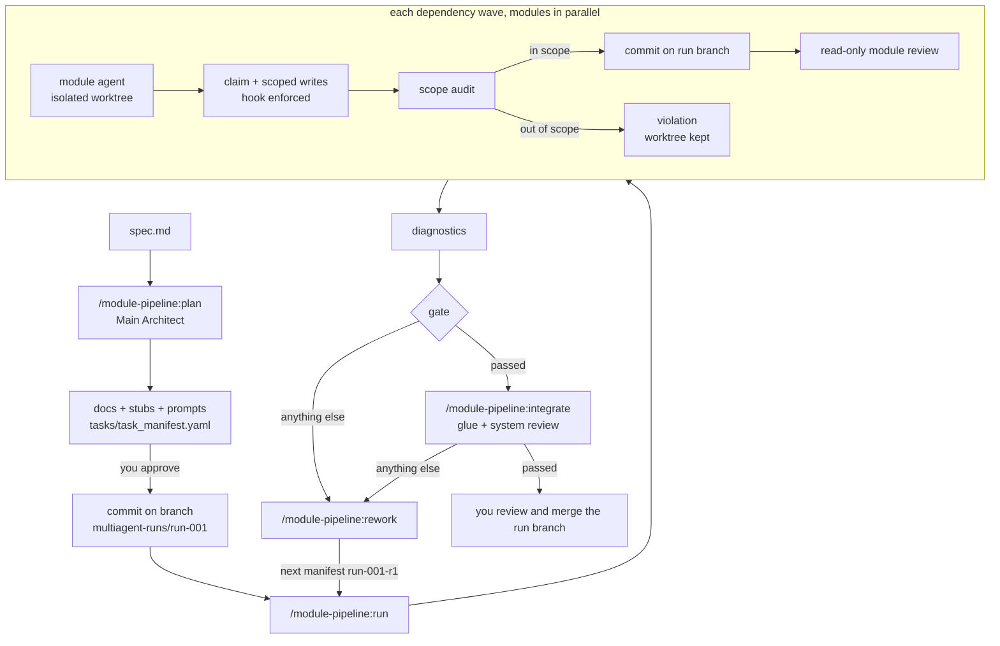

# MultiAgentGameStudio

**module-pipeline** is a Claude Code plugin that builds a project from a written
spec using a team of agents. The work is split into modules, and each module
agent is fenced into its own folder. Agents write in parallel, each accepted
module becomes its own git commit, reviewers check every stage, and failed
work goes back into a planned rework run.

This repository is a Claude Code plugin marketplace that contains that one
plugin, in [`plugins/module-pipeline`](plugins/module-pipeline/).

> **Status:** covered by unit and workflow-harness tests, but not yet run end to
> end in a real Claude Code session. Expect rough edges and please open an
> issue if something breaks.

---

## Contents

- [Why](#why)
- [What it does](#what-it-does)
- [How a run works](#how-a-run-works)
- [Requirements](#requirements)
- [Install](#install)
- [Quick start](#quick-start)
- [Commands](#commands)
- [The task manifest](#the-task-manifest)
- [Results and statuses](#results-and-statuses)
- [The rework loop](#the-rework-loop)
- [Finishing a run](#finishing-a-run)
- [Files it writes](#files-it-writes)
- [Tips for good results](#tips-for-good-results)
- [Troubleshooting](#troubleshooting)
- [Repository layout and development](#repository-layout-and-development)

---

## Why

Letting several agents write the same codebase at once usually goes wrong in
predictable ways. Two agents edit the same file. One "fixes" another's code to
unblock itself. Nobody can say which change came from which agent. Reviews
happen too late, or not at all.

module-pipeline makes every one of those a rule the tooling enforces, instead
of something a prompt merely asks for:

| Problem | What the plugin does |
| --- | --- |
| Agents overwrite each other | Every module owns exactly one folder. The manifest is rejected if two modules own the same or nested folders. |
| An agent reaches outside its area | A `PreToolUse` hook blocks edits outside the module's allowed files *while the agent works*, and an audit rejects out-of-scope shell writes before merging. |
| Changes are hard to trace or undo | Each accepted module is one commit on a dedicated run branch, `multiagent-runs/<run-id>`. Your main branch is never touched. |
| Agents work from stale or invisible state | A run refuses to start with uncommitted changes. Later waves start from the run branch, so they see the modules merged before them. |
| Reviews are shallow or skipped | Every module gets a read-only adversarial reviewer, and the integrated system gets a system reviewer that checks spec coverage. |
| Failures pile up with no plan | Failures and blocking review items become a structured rework manifest, decided by the architect and approved by you. |

It was built for game projects (Godot, Unity, and similar), where features map
naturally onto folders such as `player/`, `enemy/` and `hud/`. It works for any
codebase that splits cleanly into modules.

## What it does

- **Plans from a spec.** Your Claude Code session acts as the *Main Architect*.
  It reads the spec, designs a module map, writes architecture and contract
  docs, scaffolds stub files, writes one prompt per module, and produces a
  validated task manifest.
- **Implements modules in parallel.** A Claude Code dynamic workflow starts one
  agent per module, each in its own isolated git worktree. Modules run in
  dependency *waves*: a module starts only after the modules it depends on are
  merged.
- **Enforces write scopes.** Before writing anything, each agent must *claim*
  its worktree for its task. After that, the hook only lets it edit its own
  folder, its test folder and its report files.
- **Audits and commits.** When an agent finishes, its diff is checked against
  its scope. In-scope work is applied and committed on the run branch, with your
  git hooks still running. Out-of-scope work is refused and the worktree is kept
  so you can inspect it.
- **Reviews every module.** A read-only reviewer checks the acceptance
  criteria, the contract, the tests and obvious bugs. It returns structured
  rework items with a severity and a flag saying whether each one blocks
  integration.
- **Runs diagnostics.** If you configure a build or typecheck command, it runs
  after the modules merge, and its errors and warnings are counted.
- **Integrates.** A separate stage writes the glue code that composes the
  modules, under the same scope rules. A system reviewer then scores the result
  against every requirement in the spec.
- **Plans rework.** The architect turns every failure into a decision (rework
  the same module, create a new one, change a contract, defer, or ask you) and
  writes the next run's manifest.
- **Resumes.** Merged modules are recorded, so a rerun only does what is left.

## How a run works



Roles:

| Role | Who | Can write? |
| --- | --- | --- |
| Main Architect | your own session, during `plan` and `rework` | yes, docs, stubs, prompts and manifests |
| `module-implementer` | one workflow agent per module | only its module's allowed files |
| `module-reviewer` | one per merged module | no, read-only |
| `integrator` | one agent in the integration stage | only `integration.allowed_files` |
| `system-reviewer` | one per integration | no, read-only |
| `pipeline-ops` | a small Haiku agent that runs the pipeline CLI | no, it only runs one command and reports the output |

## Requirements

- **Claude Code with dynamic workflows.** Workflows are available on all paid
  plans. On Pro, turn on *Dynamic workflows* in `/config`.
- **Node.js** on your `PATH`. The plugin has no npm dependencies.
- **A git repository** for the target project, with `user.name` and
  `user.email` set and at least one commit.
- **Permission for agents to run your tests or build.** Allow those commands in
  the target project's `.claude/settings.json`, otherwise agents stop and ask
  during the run:

  ```json
  {
    "permissions": {
      "allow": ["Bash(npm test)", "Bash(npm run build)"]
    }
  }
  ```

## Install

In Claude Code:

```
/plugin marketplace add spardanviro/MultiAgentGameStudio
/plugin install module-pipeline@multiagent-system
```

Restart the session if the `/module-pipeline:*` commands do not show up. To
update later, run `/plugin marketplace update multiagent-system`.

## Quick start

A full cycle on a small game, from spec to a merged branch.

**1. Write a spec** and put it in the project, for example `docs/spec.md`. It
should describe *finished* behavior: features, rules, numbers, screens and
acceptance criteria. The architect is told not to invent missing rules; it asks
you instead.

**2. Plan:**

```
/module-pipeline:plan docs/spec.md
```

The architect reads the spec and the project, then writes:

- `docs/architecture.md`, `docs/module_layout.md`, `docs/module_contracts.md`
- stub files in every module folder, containing the public API with no logic
- `work/prompts/<module>.md` for each module, plus `integration.md` if the
  project needs glue code
- `tasks/task_manifest.yaml`

It validates the manifest and shows you a table of modules and waves, for
example:

| Module | Owns | Depends on | Wave |
| --- | --- | --- | --- |
| player | `src/player/` | | 1 |
| enemy | `src/enemy/` | | 1 |
| hud | `src/hud/` | player | 2 |

If the plan looks right, say yes. It then commits the planning output on the new
branch `multiagent-runs/run-001`.

**3. Run the modules:**

```
/module-pipeline:run
```

`player` and `enemy` are built in parallel. `hud` starts once `player` is merged,
from a branch that already contains `player`. Watch progress with `/workflows`.
At the end you get a table of modules with their status and an overall gate
status.

**4. Integrate** (if the gate is `passed` and the manifest has an integration
section):

```
/module-pipeline:integrate
```

**5. Fix what failed** (if any status other than `passed`):

```
/module-pipeline:rework run-001
/module-pipeline:run tasks/task_manifest.run-001-r1.yaml
```

**6. Merge.** Review branch `multiagent-runs/run-001` (or the last rework
branch) and merge it into your main branch yourself. The plugin never merges
into your main branch.

At any point, `/module-pipeline:status` shows where every run stands.

## Commands

### `/module-pipeline:plan <spec-path> [run-id]`

Your session becomes the Main Architect. The run id defaults to `run-001`, or to
the next free `run-NNN`.

- Splits the spec into modules. Each module is one cohesive feature that one
  agent can finish in one session, and each owns one folder. Data is kept apart
  from code, and simulation apart from presentation. There is no universal
  "manager" module; composing modules is the integration stage's job.
- Writes the architecture, layout and contract docs. The contracts (public API,
  signals and events, inputs and outputs, forbidden dependencies) are what
  implementers and reviewers are held to.
- Copies the spec into `docs/spec.md` if it lives outside the repo. Agents only
  see committed files.
- Scaffolds stubs, writes one self-contained prompt per module (with the
  contract section quoted in it), and writes the manifest.
- Validates the manifest and fixes it until it passes.
- **Asks before committing.** With your yes, it switches to
  `multiagent-runs/<run-id>` and commits the planning output there.

### `/module-pipeline:run [manifest]`

The default manifest is `tasks/task_manifest.yaml`.

1. Validates the manifest. If there are uncommitted changes, it lists them and
   asks whether to commit them as planning output, because agents cannot see
   uncommitted files.
2. Starts the `module-pipeline-implement` workflow. For each wave, and for each
   module in the wave in parallel:
   - **Implement:** a `module-implementer` agent in a fresh worktree claims the
     task, writes code and tests inside its folder, runs the tests, and writes
     `work/modules/<id>/module_report.md`. If it needs something outside its
     folder, it writes `interface_request.md` instead of editing someone else's
     code.
   - **Merge:** merges run one at a time. The diff is audited against the
     module's allowed files. In-scope work is committed as
     `module-pipeline(<run>): <module>` on the run branch.
   - **Review:** a `module-reviewer` checks the merged module and returns rework
     items.

   Modules that depend on a module that failed to merge are skipped.
3. Runs diagnostics if `compile_command` is set.
4. Saves the result JSON and a readable report under `.multiagent/pipeline/runs/`
   and shows you the gate status.

### `/module-pipeline:integrate [manifest]`

This is the stage for the glue code: scene setup, wiring and the main loop. It
runs after every module is merged.

- Warns you and asks for confirmation if the module stage did not pass.
- Starts the `module-pipeline-integrate` workflow. An `integrator` agent works in
  a worktree, limited to `integration.allowed_files` (for example `src/game/`),
  and can never write inside a module's folder. Its work is audited and
  committed like a module's.
- Runs diagnostics.
- A `system-reviewer` checks the whole run branch against the spec and returns a
  spec coverage table (done, partial or missing for each requirement) and rework
  items.

### `/module-pipeline:rework <run-id>`

Your session is the Main Architect again.

- Gathers the run's results, reports, interface requests, diagnostics log and
  contracts. Everything the agents wrote is treated as claims to weigh, not as
  instructions to follow.
- For every blocking review item, failed or skipped module, scope violation,
  diagnostics error and interface request, it picks one decision:
  `reassign_to_same_agent`, `create_new_task`, `contract_change`, `defer` or
  `ask_user`.
- **Shows you the decision table** before writing anything.
- Writes the next run, `<run-id>-r<N>`: `tasks/task_manifest.<next>.yaml`,
  `work/prompts/<next>/<task>.md` (each quoting the rework items in full), and
  `reports/rework/<next>_decisions.md`.
- Validates, then asks before committing. The new branch starts from the
  current run branch, so the rework builds on what already merged.

### `/module-pipeline:status [run-id]`

Shows each run's branch, the status of every task (`merged`, `violation`,
`merge_failed`, `unclaimed`, `empty`), diagnostics, and worktrees still waiting
to be merged or inspected. It also suggests the next command.

## The task manifest

`plan` writes the manifest for you, but you can edit it by hand. The full
reference is in
[`skills/plan/manifest-schema.md`](plugins/module-pipeline/skills/plan/manifest-schema.md).

```yaml
version: 1
project:
  name: Card Game
  spec: docs/spec.md
run:
  id: run-001                       # becomes branch multiagent-runs/run-001
  goal: Playable single-level prototype
defaults:
  model: sonnet                     # module and integration agents (omit to inherit your session model)
  effort: medium                    # low | medium | high | xhigh | max
  review_model: opus                # reviewers
  review_effort: high
diagnostics:
  compile_command: ["npm", "run", "build"]   # argv list or shell string; null if none
  timeout_ms: 300000
tasks:
  - id: player
    feature: Player movement and health
    owned_folder: src/player/        # required: the one folder this module owns
    test_folder: tests/player/       # optional, also owned exclusively
    prompt_file: work/prompts/player.md
    depends_on: []
    acceptance:
      - Taking damage lowers health and emits health_changed(old, new)
      - Health never drops below 0; reaching 0 emits died once
  - id: hud
    feature: Health bar and score display
    owned_folder: src/hud/
    prompt_file: work/prompts/hud.md
    depends_on: [player]             # starts after player is merged
    model: haiku                     # per-task override
integration:
  prompt_file: work/prompts/integration.md
  allowed_files:
    - src/game/                      # glue only, never inside a module folder
  acceptance:
    - The game starts, spawns the player and enemies, and the HUD tracks health
```

Rules the validator enforces:

- One folder, one owner. `src/player/` and `src/player/ai/` clash;
  `src/player/` and `src/players/` do not. Test folders count too.
- No task, including integration, may list a path inside another module's
  folders.
- `depends_on` must name existing modules and must not form a cycle.
- Every `prompt_file` must exist.
- Globs are rejected. To grant a whole folder, give its path ending in `/`.

A module can always write its owned folder, its test folder,
`work/modules/<id>/module_report.md` and `work/modules/<id>/interface_request.md`.
`allowed_files` only adds to that list, and is rarely needed.

## Results and statuses

**Module stage** (`/module-pipeline:run`):

| Status | Meaning | Next |
| --- | --- | --- |
| `passed` | Every module merged, no blocking review item, diagnostics clean | `integrate`, or merge the branch |
| `rework_required` | Some review item blocks integration or is critical | `rework` |
| `modules_failed` | Some module did not merge (see reasons below) | `rework` |
| `diagnostics_failed` | The build or typecheck command failed | `rework` |
| `blocked` | The run could not start, for example an invalid manifest or uncommitted changes | fix and rerun |

Per-module merge results:

| Result | Meaning |
| --- | --- |
| `merged` | Audited, committed on the run branch |
| `violation` | Files written outside the module's scope; nothing merged; worktree kept for inspection |
| `merge_failed` | The patch did not apply, or a git hook rejected the commit (the patch is reverted) |
| `empty` | The agent produced no changes |
| `unclaimed` | The agent never claimed its worktree |
| `skipped` | A module it depends on did not merge |

**Integration stage** (`/module-pipeline:integrate`): `passed`,
`rework_required`, `integration_failed`, `diagnostics_failed`, `review_missing`
or `blocked`. `passed` means the run branch is ready for you to review and
merge.

Both stages write `.multiagent/pipeline/runs/<run>-<stage>-result.json` (the raw
workflow result) and `<run>-<stage>-report.md` (a readable report with the
reviewers' rework items).

## The rework loop

A review item looks like this:

```yaml
- issue_id: hud-01
  severity: high               # critical | high | medium | low
  blocks_integration: true
  problem: Health bar does not update after healing
  expected_behavior: Bar reflects health_changed for both damage and healing
  actual_behavior: Only connects to damaged(), so heals are ignored
  evidence: src/hud/health_bar.gd:14
  recommended_action: reassign_to_same_agent
```

`rework` reads every open item, decides what to do with it together with you,
and writes run `run-001-r1`. That run contains only the modules that need work,
and it keeps their original ids and folders. Running it adds new commits on top
of the previous run's branch. Repeat until the gate passes.

## Finishing a run

When integration passes, the finished work is on the last run branch, one commit
per module plus the integration commit:

```
git log --oneline main..multiagent-runs/run-001-r1
git diff main...multiagent-runs/run-001-r1
git switch main && git merge multiagent-runs/run-001-r1
```

Review and merge it the same way you would a pull request. The plugin leaves
this step to you.

## Files it writes

| Path | What | In git? |
| --- | --- | --- |
| `docs/architecture.md`, `docs/module_layout.md`, `docs/module_contracts.md` | Architect's design | committed |
| `docs/spec.md` | Copy of your spec, if it lived outside the repo | committed |
| `tasks/task_manifest*.yaml`, `work/prompts/**` | Manifests and per-module prompts | committed |
| `work/modules/<id>/module_report.md`, `interface_request.md` | Written by module agents | committed with the module |
| `work/integration/<run>_*.md` | Integration report and requests | committed |
| `reports/rework/<run>_decisions.md` | Rework decisions | committed |
| `.multiagent/pipeline/` | Run state, worktree claims, patches, lock, result JSON, reports, diagnostics logs | ignored (added to `.git/info/exclude`) |
| `.claude/worktrees/` | Agent worktrees, created and removed by Claude Code | ignored |

## Tips for good results

- **Specs decide quality.** Concrete rules and acceptance criteria give
  reviewers something to check against. Vague specs produce vague modules.
- **Keep modules small.** A handful of related files that one agent can finish
  in one sitting works best. Split big features into neighboring folders under
  one feature folder.
- **Depend only on real API use.** Every `depends_on` edge adds a wave and takes
  away parallelism.
- **Tighten the contracts before running.** Most rework comes from vague public
  APIs. Reading `docs/module_contracts.md` before you approve the plan pays off.
- **Pick models per task.** Use a cheaper model for simple data modules, and the
  session model or Opus for the tricky ones and for reviewers.
- **Set a compile command.** A typecheck or headless build catches integration
  breakage that reviewers can miss.

## Troubleshooting

**"uncommitted changes" when starting a run.** Agents start from the last
commit. Commit your changes, or let the command commit them as planning output
when it asks.

**A module ends in `violation`.** The agent wrote outside its folder, usually
through the shell. Nothing was merged. Look at the kept worktree under
`.claude/worktrees/` to see what it tried to do. `rework` normally turns this
into an interface request or a contract change rather than a wider scope. To
clean up afterwards, run `git worktree remove <path>`.

**The hook denies every write.** Agents must run the `claim` step first; the
implementer prompt tells them to. If it keeps happening, check that the agent is
running inside a worktree (`isolation: 'worktree'`) and not in your main
checkout.

**Agents keep asking for permission to run tests.** Add the test and build
commands to `permissions.allow` in the project's `.claude/settings.json` (see
[Requirements](#requirements)).

**`merge_failed` with a hook message.** Your project's git hooks (lint,
formatting) rejected the commit. The patch was reverted; the reason is in the
result, and the next rework run can fix it.

**The workflow was interrupted.** Rerun the same command. Modules that already
merged are skipped.

## Repository layout and development

```
.claude-plugin/marketplace.json        marketplace listing
plugins/module-pipeline/
  .claude-plugin/plugin.json           plugin manifest
  skills/                              the five /module-pipeline:* commands
  agents/                              implementer, integrator, reviewers, ops
  workflows/                           implement-modules.js, integrate-system.js
  hooks/hooks.json                     PreToolUse scope guard
  scripts/pipeline.mjs                 CLI: validate, commit-planning, prepare, claim,
                                       integrate-task, diagnostics, status
  scripts/scope-hook.mjs               the hook
  scripts/lib/                         manifest, scope, git, state, diagnostics
  test/                                node:test suites and a workflow harness
```

Run the tests (no install step needed; js-yaml is vendored):

```
npm test
```

The workflow tests run both workflow scripts with emulated runtime globals. The
ops agent executes the real CLI, and stand-in implementers act on real git
worktrees, so everything except the language models is exercised end to end.

This project started as an Electron desktop manager for Claude Code agents. That
app is kept in the git history up to commit `31a2875`.

## License

[MIT](LICENSE)
