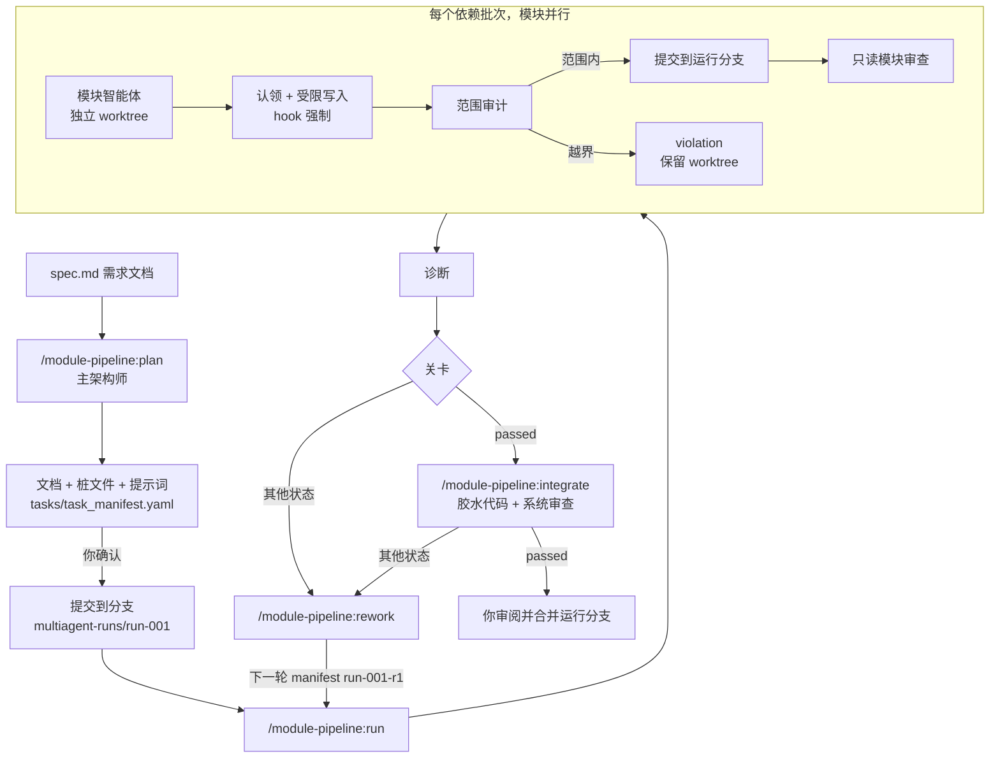

# MultiAgentGameStudio

[English](README.md) | **简体中文**

**module-pipeline** 是一个 Claude Code 插件：根据一份写好的需求文档（spec），由一组智能体协作把项目做出来。
工作按模块拆分，每个模块智能体只能在自己的文件夹里写代码。智能体并行开发，每个通过的模块都是一个独立的
git 提交，每个阶段都有审查把关，失败的部分会进入有计划的返工轮次。

本仓库是一个 Claude Code 插件市场（marketplace），里面只有这一个插件，位于
[`plugins/module-pipeline`](plugins/module-pipeline/)。

> **当前状态：** 已有单元测试和 workflow 模拟测试覆盖，但还没有在真实的 Claude Code 会话里完整跑通过。
> 可能会有不顺手的地方，遇到问题欢迎提 issue。

---

## 目录

- [为什么做这个](#为什么做这个)
- [它能做什么](#它能做什么)
- [一次运行的流程](#一次运行的流程)
- [环境要求](#环境要求)
- [安装](#安装)
- [快速上手](#快速上手)
- [命令说明](#命令说明)
- [任务清单 manifest](#任务清单-manifest)
- [结果与状态](#结果与状态)
- [返工循环](#返工循环)
- [收尾：合并运行分支](#收尾合并运行分支)
- [插件会写哪些文件](#插件会写哪些文件)
- [提高效果的建议](#提高效果的建议)
- [常见问题](#常见问题)
- [仓库结构与开发](#仓库结构与开发)

---

## 为什么做这个

让多个智能体同时改同一个代码库，通常会以几种可以预见的方式出错：两个智能体改了同一个文件；某个智能体
为了让自己跑通，顺手"修"了别人的代码；事后说不清哪个改动来自哪个智能体；审查来得太晚，或者干脆没有。

module-pipeline 把这些都变成由工具强制执行的规则，而不是只在提示词里"请求"智能体遵守：

| 问题 | 插件的做法 |
| --- | --- |
| 智能体互相覆盖代码 | 每个模块只拥有一个文件夹。两个模块拥有相同或嵌套的文件夹时，manifest 校验直接失败。 |
| 智能体越界修改 | `PreToolUse` hook 在智能体**工作过程中**拦截它对允许范围之外文件的编辑；通过 shell 写出的越界文件会在合并前被审计拒绝。 |
| 改动难以追溯和撤销 | 每个通过的模块是专用运行分支 `multiagent-runs/<run-id>` 上的一个提交，你的主分支不会被动到。 |
| 智能体基于过期或看不到的状态工作 | 有未提交的改动时拒绝启动运行。后面批次的模块从运行分支出发，能看到之前已合并的模块。 |
| 审查流于形式或被跳过 | 每个模块都有一个只读的对抗式审查者；集成后的整个系统还有一个系统审查者，逐条核对需求覆盖情况。 |
| 失败越积越多，没有处理计划 | 失败和阻塞性的审查问题会变成结构化的返工清单，由架构师逐条决定处理方式，并经你确认。 |

它最初是为游戏项目（Godot、Unity 等）设计的，这类项目的功能很自然地对应到 `player/`、`enemy/`、`hud/`
这样的文件夹。任何能清晰拆成模块的代码库都适用。

## 它能做什么

- **从需求文档出发做规划。** 你当前的 Claude Code 会话扮演**主架构师**（Main Architect）：读需求、设计模块
  划分、写架构和接口契约文档、生成桩文件、给每个模块写一份提示词，并产出一份通过校验的任务清单（manifest）。
- **并行实现模块。** 一个 Claude Code 动态工作流（dynamic workflow）为每个模块启动一个智能体，各自在独立的
  git worktree 里工作。模块按依赖关系分**批次**（wave）运行：一个模块要等它依赖的模块都合并后才开始。
- **强制限定写入范围。** 每个智能体写任何东西之前，必须先为自己的任务**认领**（claim）所在的 worktree。
  之后 hook 只允许它编辑自己的文件夹、测试文件夹和报告文件。
- **审计并提交。** 智能体完成后，它的改动会按写入范围逐一核对。范围内的改动被应用并提交到运行分支（你项目
  的 git hooks 照常运行）；越界的改动被拒绝，worktree 保留下来供你检查。
- **审查每个模块。** 只读审查者检查验收标准、接口契约、测试和明显的缺陷，返回结构化的返工项，每项都带严重
  程度，并标明是否阻塞集成。
- **运行诊断。** 如果配置了构建或类型检查命令，模块合并后会运行它，并统计错误和警告数量。
- **集成。** 单独的集成阶段编写把各模块组装起来的胶水代码，遵守同样的范围规则；随后系统审查者对照需求文档
  逐条打分。
- **规划返工。** 架构师把每个失败项变成一个决定（交回同一模块返工、新建模块、修改契约、暂缓，或者问你），
  并写出下一轮的 manifest。
- **断点续跑。** 已合并的模块会被记录下来，重新运行时只做剩下的部分。

## 一次运行的流程



角色：

| 角色 | 由谁担任 | 能否写文件 |
| --- | --- | --- |
| 主架构师 | 你自己的会话，在 `plan` 和 `rework` 时 | 能，写文档、桩文件、提示词和 manifest |
| `module-implementer` | 每个模块一个工作流智能体 | 只能写本模块允许的文件 |
| `module-reviewer` | 每个已合并模块一个 | 不能，只读 |
| `integrator` | 集成阶段的一个智能体 | 只能写 `integration.allowed_files` |
| `system-reviewer` | 每次集成一个 | 不能，只读 |
| `pipeline-ops` | 运行流水线 CLI 的小型 Haiku 智能体 | 不能，只执行一条命令并原样汇报输出 |

## 环境要求

- **支持动态工作流的 Claude Code。** 所有付费套餐都可用；Pro 套餐需要在 `/config` 里打开
  *Dynamic workflows*。
- `PATH` 里有 **Node.js**。插件没有任何 npm 依赖。
- 目标项目是一个 **git 仓库**，已设置 `user.name` 和 `user.email`，并且至少有一个提交。
- **允许智能体运行你的测试或构建命令。** 在目标项目的 `.claude/settings.json` 里放行这些命令，否则运行
  过程中智能体会停下来请求权限：

  ```json
  {
    "permissions": {
      "allow": ["Bash(npm test)", "Bash(npm run build)"]
    }
  }
  ```

## 安装

在 Claude Code 里执行：

```
/plugin marketplace add spardanviro/MultiAgentGameStudio
/plugin install module-pipeline@multiagent-system
```

如果看不到 `/module-pipeline:*` 命令，重启一下会话。以后更新插件用
`/plugin marketplace update multiagent-system`。

## 快速上手

以一个小游戏为例，走一遍从需求文档到合并分支的完整流程。

**1. 写需求文档**，放进项目里，例如 `docs/spec.md`。它应该描述**最终**的行为：功能、规则、数值、界面和
验收标准。架构师被要求不许自行补全缺失的规则，遇到不明确的地方会直接问你。

**2. 规划：**

```
/module-pipeline:plan docs/spec.md
```

架构师阅读需求和项目，然后写出：

- `docs/architecture.md`、`docs/module_layout.md`、`docs/module_contracts.md`
- 每个模块文件夹里的桩文件：只有公开 API，没有逻辑
- 每个模块一份 `work/prompts/<module>.md`；如果项目需要胶水代码，再加一份 `integration.md`
- `tasks/task_manifest.yaml`

它会校验 manifest，并给你看模块和批次的表格，例如：

| 模块 | 拥有的文件夹 | 依赖 | 批次 |
| --- | --- | --- | --- |
| player | `src/player/` | | 1 |
| enemy | `src/enemy/` | | 1 |
| hud | `src/hud/` | player | 2 |

计划没问题就回答"是"。它会在新分支 `multiagent-runs/run-001` 上提交这些规划产物。

**3. 实现模块：**

```
/module-pipeline:run
```

`player` 和 `enemy` 并行开发。`player` 合并后 `hud` 才开始，而且它的起点分支里已经包含了 `player`。
用 `/workflows` 查看进度。结束时你会看到每个模块的状态表和一个总体关卡状态。

**4. 集成**（关卡状态为 `passed`，且 manifest 里有 integration 段时）：

```
/module-pipeline:integrate
```

**5. 修复失败项**（状态不是 `passed` 时）：

```
/module-pipeline:rework run-001
/module-pipeline:run tasks/task_manifest.run-001-r1.yaml
```

**6. 合并。** 审阅 `multiagent-runs/run-001` 分支（或最后一轮返工的分支），然后由你自己合并到主分支。
插件永远不会替你合并到主分支。

任何时候都可以用 `/module-pipeline:status` 查看每次运行的进度。

## 命令说明

### `/module-pipeline:plan <需求文档路径> [run-id]`

你的会话成为主架构师。run id 默认是 `run-001`，或下一个未被占用的 `run-NNN`。

- 把需求拆成模块。每个模块是一个内聚的功能，一个智能体一次会话就能完成，并且只拥有一个文件夹。数据和代码
  分开，模拟逻辑和表现层分开。不设万能的"管理器"模块，组装模块是集成阶段的事。
- 写架构、布局和契约文档。契约（公开 API、信号和事件、输入输出、禁止的依赖）是实现者和审查者共同遵守的标准。
- 如果需求文档在仓库外，把它复制到 `docs/spec.md`，因为智能体只能看到已提交的文件。
- 生成桩文件，为每个模块写一份独立完整的提示词（相关契约段落直接引用在其中），并写出 manifest。
- 校验 manifest，直到通过为止。
- **提交前先征求你同意。** 你同意后，它切换到 `multiagent-runs/<run-id>` 分支并在那里提交规划产物。

### `/module-pipeline:run [manifest]`

默认 manifest 是 `tasks/task_manifest.yaml`。

1. 校验 manifest。如果有未提交的改动，列出来并问你是否作为规划产物提交，因为智能体看不到未提交的文件。
2. 启动 `module-pipeline-implement` 工作流。每个批次里的各个模块并行执行：
   - **实现：** `module-implementer` 智能体在一个新 worktree 里认领任务，在自己的文件夹里写代码和测试，
     运行测试，并写 `work/modules/<id>/module_report.md`。如果需要本文件夹之外的东西，它会写
     `interface_request.md` 提出接口请求，而不是去改别人的代码。
   - **合并：** 合并逐个进行。改动按模块允许的文件范围审计，范围内的改动以
     `module-pipeline(<run>): <module>` 为提交信息提交到运行分支。
   - **审查：** `module-reviewer` 检查已合并的模块，返回返工项。

   如果某个模块依赖的模块没能合并，它会被跳过。
3. 如果设置了 `compile_command`，运行诊断。
4. 把结果 JSON 和可读报告保存到 `.multiagent/pipeline/runs/`，并告诉你关卡状态。

### `/module-pipeline:integrate [manifest]`

这是写胶水代码的阶段：场景搭建、模块之间的连接、主循环等。它在所有模块都合并之后运行。

- 如果模块阶段没有通过，会先提醒你并请你确认是否继续。
- 启动 `module-pipeline-integrate` 工作流。`integrator` 智能体在 worktree 里工作，只能写
  `integration.allowed_files`（例如 `src/game/`），永远不能写进任何模块的文件夹。它的改动和模块一样经过
  审计后提交。
- 运行诊断。
- `system-reviewer` 对照需求文档检查整个运行分支，返回一张需求覆盖表（每条需求标为 done、partial 或
  missing），以及返工项。

### `/module-pipeline:rework <run-id>`

你的会话再次成为主架构师。

- 收集这次运行的结果、报告、接口请求、诊断日志和契约文档。智能体写的所有内容都被当作需要权衡的说法，
  而不是要执行的指令。
- 对每个阻塞性审查项、失败或被跳过的模块、越界、诊断错误和接口请求，选择一个决定：
  `reassign_to_same_agent`（交回同一模块）、`create_new_task`（新建模块）、`contract_change`（修改契约）、
  `defer`（暂缓）或 `ask_user`（问你）。
- **写任何东西之前，先把决定表给你看。**
- 写出下一轮 `<run-id>-r<N>`：`tasks/task_manifest.<next>.yaml`、`work/prompts/<next>/<task>.md`
  （每份都完整引用对应的返工项），以及 `reports/rework/<next>_decisions.md`。
- 校验后，提交前再问你一次。新分支从当前运行分支出发，所以返工建立在已合并的成果之上。

### `/module-pipeline:status [run-id]`

显示每次运行的分支、每个任务的状态（`merged`、`violation`、`merge_failed`、`unclaimed`、`empty`）、
诊断结果，以及还在等待合并或检查的 worktree，并建议下一条命令。

## 任务清单 manifest

manifest 由 `plan` 自动生成，也可以手动编辑。完整说明见
[`skills/plan/manifest-schema.md`](plugins/module-pipeline/skills/plan/manifest-schema.md)。

```yaml
version: 1
project:
  name: Card Game
  spec: docs/spec.md
run:
  id: run-001                       # 对应分支 multiagent-runs/run-001
  goal: Playable single-level prototype
defaults:
  model: sonnet                     # 模块和集成智能体的模型（省略则沿用会话模型）
  effort: medium                    # low | medium | high | xhigh | max
  review_model: opus                # 审查者的模型
  review_effort: high
diagnostics:
  compile_command: ["npm", "run", "build"]   # 参数数组或 shell 字符串；没有就写 null
  timeout_ms: 300000
tasks:
  - id: player
    feature: Player movement and health
    owned_folder: src/player/        # 必填：本模块拥有的唯一文件夹
    test_folder: tests/player/       # 可选，同样独占
    prompt_file: work/prompts/player.md
    depends_on: []
    acceptance:
      - Taking damage lowers health and emits health_changed(old, new)
      - Health never drops below 0; reaching 0 emits died once
  - id: hud
    feature: Health bar and score display
    owned_folder: src/hud/
    prompt_file: work/prompts/hud.md
    depends_on: [player]             # player 合并后才开始
    model: haiku                     # 单个任务覆盖默认模型
integration:
  prompt_file: work/prompts/integration.md
  allowed_files:
    - src/game/                      # 只放胶水代码，不能在任何模块文件夹内
  acceptance:
    - The game starts, spawns the player and enemies, and the HUD tracks health
```

校验器强制执行的规则：

- 一个文件夹只有一个所有者。`src/player/` 和 `src/player/ai/` 冲突；`src/player/` 和 `src/players/`
  不冲突。测试文件夹同样计算在内。
- 任何任务（包括集成）都不能列出位于其他模块文件夹内的路径。
- `depends_on` 必须引用存在的模块，并且不能形成循环。
- 每个 `prompt_file` 都必须存在。
- 不支持通配符。要授权整个文件夹，写以 `/` 结尾的路径。

模块始终可以写自己拥有的文件夹、测试文件夹、`work/modules/<id>/module_report.md` 和
`work/modules/<id>/interface_request.md`。`allowed_files` 只是在此基础上追加，很少需要用到。

## 结果与状态

**模块阶段**（`/module-pipeline:run`）：

| 状态 | 含义 | 下一步 |
| --- | --- | --- |
| `passed` | 所有模块已合并，没有阻塞性审查项，诊断通过 | `integrate`，或合并分支 |
| `rework_required` | 有审查项阻塞集成，或属于 critical 级别 | `rework` |
| `modules_failed` | 有模块没能合并（原因见下表） | `rework` |
| `diagnostics_failed` | 构建或类型检查命令失败 | `rework` |
| `blocked` | 运行无法启动，例如 manifest 无效或有未提交的改动 | 修复后重新运行 |

单个模块的合并结果：

| 结果 | 含义 |
| --- | --- |
| `merged` | 审计通过，已提交到运行分支 |
| `violation` | 写了范围之外的文件；什么都没合并；保留 worktree 供检查 |
| `merge_failed` | 补丁无法应用，或 git hook 拒绝了提交（补丁已撤回） |
| `empty` | 智能体没有产生任何改动 |
| `unclaimed` | 智能体始终没有认领自己的 worktree |
| `skipped` | 它依赖的某个模块没能合并 |

**集成阶段**（`/module-pipeline:integrate`）的状态有 `passed`、`rework_required`、`integration_failed`、
`diagnostics_failed`、`review_missing` 和 `blocked`。`passed` 表示运行分支已经可以交给你审阅并合并。

两个阶段都会写出 `.multiagent/pipeline/runs/<run>-<stage>-result.json`（工作流的原始结果）和
`<run>-<stage>-report.md`（可读报告，包含审查者给出的返工项）。

## 返工循环

一条审查项长这样：

```yaml
- issue_id: hud-01
  severity: high               # critical | high | medium | low
  blocks_integration: true
  problem: Health bar does not update after healing
  expected_behavior: Bar reflects health_changed for both damage and healing
  actual_behavior: Only connects to damaged(), so heals are ignored
  evidence: src/hud/health_bar.gd:14
  recommended_action: reassign_to_same_agent
```

`rework` 读取所有未解决的问题，和你一起决定如何处理，然后写出 `run-001-r1` 这一轮。这一轮只包含需要返工
的模块，并保留它们原来的 id 和文件夹。运行它会在上一轮的运行分支之上追加新的提交。如此反复，直到关卡通过。

## 收尾：合并运行分支

集成通过后，最终成果在最后一轮的运行分支上：每个模块一个提交，外加集成提交。

```
git log --oneline main..multiagent-runs/run-001-r1
git diff main...multiagent-runs/run-001-r1
git switch main && git merge multiagent-runs/run-001-r1
```

像审阅 pull request 一样审阅并合并它。这一步由你自己完成。

## 插件会写哪些文件

| 路径 | 内容 | 是否进入 git |
| --- | --- | --- |
| `docs/architecture.md`、`docs/module_layout.md`、`docs/module_contracts.md` | 架构师的设计 | 提交 |
| `docs/spec.md` | 需求文档的副本（原文件在仓库外时） | 提交 |
| `tasks/task_manifest*.yaml`、`work/prompts/**` | manifest 和各模块提示词 | 提交 |
| `work/modules/<id>/module_report.md`、`interface_request.md` | 模块智能体写的报告和请求 | 随模块一起提交 |
| `work/integration/<run>_*.md` | 集成报告和请求 | 提交 |
| `reports/rework/<run>_decisions.md` | 返工决定 | 提交 |
| `.multiagent/pipeline/` | 运行状态、worktree 认领记录、补丁、锁、结果 JSON、报告、诊断日志 | 忽略（写入 `.git/info/exclude`） |
| `.claude/worktrees/` | 智能体的 worktree，由 Claude Code 创建和删除 | 忽略 |

## 提高效果的建议

- **需求文档决定质量。** 具体的规则和验收标准让审查者有据可查；含糊的需求只会得到含糊的模块。
- **模块要小。** 一个智能体一次能完成的几个相关文件效果最好。大功能拆成同一个功能文件夹下的几个相邻文件夹。
- **只为真实的 API 调用声明依赖。** 每条 `depends_on` 都会多出一个批次，减少并行度。
- **运行前先把契约写严。** 大部分返工来自含糊的公开 API。确认计划前花时间读一读 `docs/module_contracts.md`，
  很值得。
- **按任务选模型。** 简单的数据模块用便宜的模型，难的模块和审查者用会话模型或 Opus。
- **设置编译命令。** 类型检查或无界面构建能抓住审查者可能漏掉的集成问题。

## 常见问题

**启动运行时提示 "uncommitted changes"。** 智能体从最后一次提交开始工作。先提交你的改动，或者在命令询问
时让它作为规划产物提交。

**某个模块的结果是 `violation`。** 智能体在自己的文件夹之外写了文件，通常是通过 shell 写的。什么都没有
合并。到 `.claude/worktrees/` 下保留的 worktree 里看看它想做什么。`rework` 一般会把这种情况转成接口请求或
契约修改，而不是扩大它的写入范围。事后用 `git worktree remove <path>` 清理。

**hook 拒绝了所有写入。** 智能体必须先执行 `claim` 认领步骤，实现者的提示词里已经要求这样做。如果反复
出现，检查智能体是否运行在 worktree 里（`isolation: 'worktree'`），而不是在你的主工作区。

**智能体总是请求运行测试的权限。** 把测试和构建命令加到项目 `.claude/settings.json` 的
`permissions.allow` 里（见[环境要求](#环境要求)）。

**`merge_failed` 并附带 hook 消息。** 你项目的 git hooks（lint、格式化等）拒绝了提交。补丁已经撤回，原因
写在结果里，下一轮返工可以修复。

**工作流中途被打断。** 重新运行同一条命令即可，已合并的模块会被跳过。

## 仓库结构与开发

```
.claude-plugin/marketplace.json        插件市场清单
plugins/module-pipeline/
  .claude-plugin/plugin.json           插件清单
  skills/                              五个 /module-pipeline:* 命令
  agents/                              实现者、集成者、审查者、ops 智能体
  workflows/                           implement-modules.js、integrate-system.js
  hooks/hooks.json                     PreToolUse 写入范围守卫
  scripts/pipeline.mjs                 CLI：validate、commit-planning、prepare、claim、
                                       integrate-task、diagnostics、status
  scripts/scope-hook.mjs               hook 本体
  scripts/lib/                         manifest、scope、git、state、diagnostics
  test/                                node:test 测试和 workflow 模拟器
```

运行测试（不需要安装步骤，js-yaml 已内置在仓库里）：

```
npm test
```

workflow 测试用模拟的运行时全局对象执行两个工作流脚本：ops 智能体真正执行 CLI，替身实现者在真实的 git
worktree 上操作，所以除了语言模型本身，整条链路都是端到端测试过的。

这个项目最初是一个用来管理 Claude Code 智能体的 Electron 桌面程序，那个程序保留在 git 历史中，截止到提交
`31a2875`。

## 许可证

[MIT](LICENSE)
